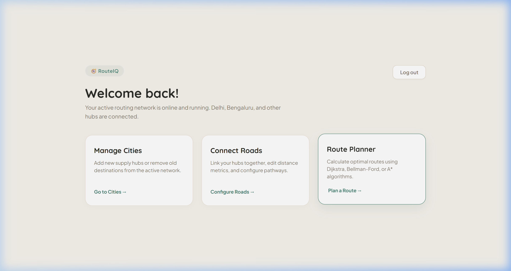
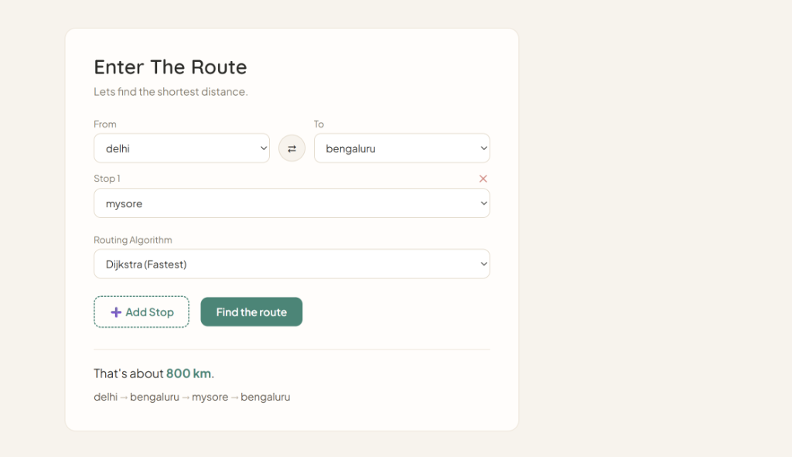

# 🚗 GoRoute

A premium, full-stack route optimization platform that enables users to manage city networks, connect roads, and compute optimal routes between cities using **Dijkstra, Bellman-Ford, and A* Graph Algorithms**, with support for **dynamic intermediate stops**.

---

## 🌐 Live Demo

**Live:** https://backend-proj-blue.vercel.app/

## 💻 Source Code

**GitHub:** https://github.com/aayush0012/Go_Route-Graph-Based-Route-Optimiser-

---

# ✨ Features

- 🔐 **Secure JWT Authentication**: User registration, login, and secure token storage.
- 👥 **Access as Guest**: Single-click guest login for immediate system evaluation.
- 🏙️ **City Hub Management**: CRUD operations to register new logistics cities dynamically.
- 🛣️ **Road Network Designer**: Link cities together, set driving distances, and configure bidirectional or one-way routes.
- 📍 **Multi-Algorithm Routing**: Compute optimal paths using **Dijkstra (Fastest)**, **Bellman-Ford (Negative Edge/Standard)**, or **A* (Heuristic)** search.
- 🛑 **Dynamic Intermediate Stops**: Add multiple waypoints along the journey (e.g. Delhi ➔ Bengaluru ➔ Mysore) to calculate segmented multi-hop routes sequentially.
- 🎨 **Premium UI Design**: Clean, handcrafted, card-grid dashboard layout styled with **Plus Jakarta Sans** typography and a warm tone aesthetic.

---

# 📸 Application Screenshots

## Dashboard

<p align="center">
  
</p>

---

## Route Planner

<p align="center">
  
</p>

---

# 🛠 Tech Stack

### Frontend

- React.js
- React Router

### Backend

- FastAPI
- SQLAlchemy ORM
- Pydantic
- Uvicorn

### Database

- PostgreSQL (Neon Serverless)

### Deployment

- Render
- Vercel

---

# 🏗️ Project Architecture

```
React Frontend (GoRoute)
        │
        ▼
   Axios Client
        │
        ▼
  FastAPI Backend (Uvicorn)
        │
        ▼
  SQLAlchemy ORM
        │
        ▼
 PostgreSQL Database
        │
        ▼
 Segmented Routing Engine
   ├── Dijkstra's Algorithm
   ├── Bellman-Ford Algorithm
   └── A* Heuristic Algorithm
```

---

# 📂 Folder Structure

```
backend/
│
├── app/
│   ├── api/          # Route handlers (users, cities, roads, routes)
│   ├── database/     # DB Session & engine configuration
│   ├── models/       # SQLAlchemy models (User, City, Road)
│   ├── schemas/      # Pydantic schemas
│   ├── services/     # Pathfinding algorithms
│   └── main.py       # FastAPI application entrypoint
│
├── Dockerfile
└── requirements.txt


frontend/
│
├── src/
│   ├── components/   # Layout and Navigation bar
│   ├── pages/        # Dashboard, Cities, Roads, RoutePlanner, Login, Register
│   ├── services/     # Axios client configuration
│   └── App.jsx       # Routing rules
│
├── package.json
└── vite.config.js
```

---

# 🛣️ Route Optimization & Algorithms

GoRoute models your transportation network as a **weighted directed graph**:
- **Cities** act as vertices (nodes).
- **Roads** act as weighted directed or undirected edges (distances).

The engine partitions routes with intermediate waypoints into consecutive segments and executes the chosen search algorithm:
1. **Dijkstra's Algorithm**: Rapid greedy search suitable for finding the absolute shortest paths.
2. **Bellman-Ford Algorithm**: Classical edge relaxation, supporting negative weights and verifying cyclic connectivity.
3. **A\* Algorithm**: Heuristic-guided search utilizing a coordinated spatial heuristic ($h(n) = 0$ spatial coordinates fallback).

---

# 📡 REST API Endpoints

## Authentication

| Method | Endpoint | Description |
|---------|----------|-------------|
| POST | `/register` | Register a new user |
| POST | `/login` | Authenticate credentials and return JWT |
| POST | `/login/guest` | Generate a session token for guest users |

---

## Cities

| Method | Endpoint | Description |
|---------|----------|-------------|
| GET | `/cities/` | List all registered cities |
| POST | `/cities/` | Register a new city |
| DELETE | `/cities/{id}` | Delete a city hub |

---

## Roads

| Method | Endpoint | Description |
|---------|----------|-------------|
| GET | `/roads/` | List all road connections |
| POST | `/roads/` | Link two cities with a road |
| DELETE | `/roads/{id}` | Remove a road connection |

---

## Route

| Method | Endpoint | Description |
|---------|----------|-------------|
| POST | `/route/` | Calculate the shortest path with stops |

---

# 🚀 Running Locally

## Backend

```bash
cd backend

python -m venv venv

# Windows
venv\Scripts\activate

pip install -r requirements.txt

uvicorn app.main:app --reload
```

Runs on:

```
http://localhost:8000
```

---

## Frontend

```bash
cd frontend

npm install

npm run dev
```

Runs on:

```
http://localhost:5173
```

---

# 📌 Future Enhancements

- Traffic-Based Route Optimization
- Road Closure Support
- Multiple Route Suggestions
- Interactive Maps
- Route History

---

# 👨‍💻 Author

**Aayush Bhatt**

GitHub: https://github.com/aayush0012

LinkedIn: https://www.linkedin.com/in/aayush-bhatt-3657b1314/

---
